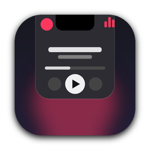
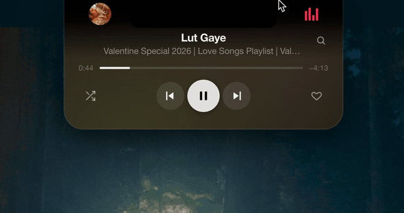

<div align="center">



# Notch Porch

**A widget dock that lives in your MacBook's notch.**
Hover the notch and a card drops down. Move away and it folds back. Starring: a YouTube Music player with ad blocking.



</div>

## Features

- **Lives in the notch.** Collapsed, it shows album art and a live visualizer on either side of the notch. Hover to open the full card, move away to fold it back.
- **YouTube Music player.** Play/pause, next/previous, shuffle, like, seek. It runs YouTube Music in a hidden window, so your own account, library and playlists just work.
- **Search inside the notch.** Click the magnifier, type, and play a song without opening any window.
- **Ad blocking.** Network ad/tracker blocking plus an ad-skip script, so music keeps playing.
- **Live equalizer.** The bars beside the notch follow the actual audio (bass to treble), and the Album colors theme pulses gently with the beat.
- **Sleep mode.** If nothing has played for 5 minutes, the disc and bars fade away and only a dim music note is left. Hover the notch, or start a song, to wake it.
- **Themes.** Dark, Liquid glass, and **Album colors**, a slowly drifting gradient taken from the current cover art. Every theme fades to pure black at the top so the card merges with the hardware notch.
- **Resource leaf.** A green leaf in the menu says everything is normal. It turns yellow and tells you when the app is using significant CPU or memory, or draining the battery.
- **Quits cleanly.** Quitting Notch Porch also closes the hidden music player. Nothing keeps playing in the background.
- **Widgets are plug-ins.** Add a folder under `widgets/` and it becomes a new page. See [Writing a widget](#writing-a-widget).

## Requirements

- A Mac with Apple Silicon (every MacBook with a notch is one). Tested on macOS 15.
- A YouTube Music account (free works).
- It also runs on Macs without a notch. The card then hangs from the top centre of the screen.

## Install

### Option 1: one line

```bash
curl -fsSL https://raw.githubusercontent.com/shubhamcodess/notch-porch/main/scripts/install.sh | bash
```

Downloads the latest release into `/Applications` and opens it. Because `curl` downloads aren't quarantined, macOS doesn't show a warning.

### Option 2: download the DMG

1. Download **Notch-Porch-arm64.dmg** from the [latest release](https://github.com/shubhamcodess/notch-porch/releases/latest).
2. Open it and drag **Notch Porch** into **Applications**.
3. Open Notch Porch. macOS will say it can't verify the app (see below). Go to **System Settings → Privacy & Security**, scroll down, click **Open Anyway**, and confirm.

   Or, in Terminal, run this once and then open the app normally:

   ```bash
   xattr -cr "/Applications/Notch Porch.app"
   ```

**Why the warning?** Notch Porch is a free hobby project and isn't signed with a paid Apple Developer certificate or notarized. macOS shows this prompt for any app that isn't. The code is all in this repo, and you can build it yourself.

### Option 3: build from source

```bash
git clone https://github.com/shubhamcodess/notch-porch.git
cd notch-porch
npm install
npm start          # run it
npm run dist       # build dist/Notch-Porch-arm64.dmg and .zip
```

Needs Node 20+.

## First run

1. A small pill-and-bars icon appears in the menu bar, and a small pill sits beside the notch. There's no Dock icon.
2. Hover the notch to open the card, then click **Click to open YouTube Music**. (Or use **Menu-bar icon → Open YouTube Music window**.)
3. Sign in to your Google account and play anything. Close the window; it just hides.
4. Your login is remembered. From now on the notch shows what's playing.

### If Google refuses the sign-in

Google sometimes says "this browser may not be secure". Import your cookies instead:

1. Export your `youtube.com` / `google.com` cookies as JSON (the Cookie-Editor extension's export works).
2. **Menu-bar icon → Show data folder**, and save the file there as `cookies.json`.
3. **Menu-bar icon → Re-import cookies.json**.

`cookies.json` stays on your Mac and is git-ignored. Treat it like a password.

## Using it

| Do this | To get this |
|---|---|
| Hover the notch | Open the card |
| Move the cursor away | Fold it back |
| Click the magnifier (or double-click the title) | Search for a song. Enter plays the first result, Esc goes back |
| Click shuffle | Shuffle the current queue. With nothing playing, it starts a shuffled mix from your recently played songs (signed in) or YouTube Music's home picks (signed out) |
| Two-finger swipe sideways | Switch widgets (when you have more than one) |
| Menu-bar icon | Theme, Launch at login, resource status, YouTube Music window, Reload, Quit |

Settings live in `~/Library/Application Support/notch-porch/settings.json`:

| Key | Default | Meaning |
|---|---|---|
| `theme` | `dark` | `dark`, `glass` or `art` (also in the menu) |
| `accent` | `#ff375f` | Accent colour for the visualizer and active buttons |
| `notchWidth` | `200` | Notch width in px, if the pill doesn't line up with your notch |
| `adblock` | `true` | Turn the ad blocker off |
| `sleepMinutes` | `5` | Minutes paused before sleep mode (`0` = never). Also in the menu: Sleep after pause |

## Writing a widget

A widget is a folder in `widgets/`:

```
widgets/my-widget/
├── manifest.json   { "name": "My widget", "order": 3, "renderer": "widget.js", "main": "main.js" }
├── widget.js       export default { mount({ page, compact: { left, right }, api }) {} }
└── main.js         optional: exports.setup = (ctx) => {}   // runs in the main process
```

- `page` is the open card. `compact.left` and `compact.right` are the two slots beside the notch while collapsed.
- `api.invoke(name, …)` / `api.on(name, cb)` talk to your `main.js` over a namespaced channel. `api.setActivity(true)` claims the collapsed slots, and `api.setPalette(colors)` tints the Album colors theme.
- In `main.js`, `ctx.handle(name, fn)`, `ctx.send(name, data)`, `ctx.menuItems` (adds tray menu items) and `ctx.onQuit(fn)` are available.

`widgets/_example` is a small clock widget to copy. Folders starting with `_` are ignored.

## Project layout

```
src/main/        Electron main process: notch window, tray, resource monitor
src/renderer/    The card UI shell: layout, themes, hover logic, page switching
widgets/music/   The YouTube Music widget (UI + hidden player + search)
widgets/_example A starter widget
scripts/         install.sh, ad-hoc signing hook
.github/         Release workflow: push a v* tag to build and publish
```

## Uninstall

Quit from **Menu-bar icon → Quit Notch Porch**, delete the app from Applications, and optionally remove your data:

```bash
rm -rf ~/Library/Application\ Support/notch-porch
```

## Disclaimer

Notch Porch is an independent project and is **not affiliated with or endorsed by Google or YouTube**. It loads the official YouTube Music website in a hidden window and adds a notch interface on top. Blocking ads may go against YouTube's terms of service; use it at your own discretion, and consider [YouTube Premium](https://www.youtube.com/premium) to support artists and the platform.

## License

[MIT](LICENSE) © Shubham Prakash
